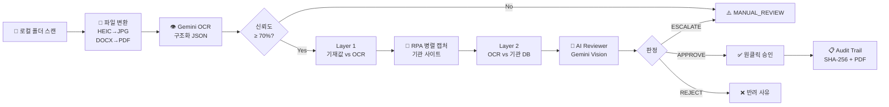

# HR AI 서류 진위확인 솔루션

> **채용 서류 위조를 AI가 자동으로 잡아냅니다**  
> Gemini Vision OCR × Puppeteer RPA × Triple Check Pipeline

<div align="center">


</div>

---

## 🎯 What is this?

채용 과정에서 지원자가 제출한 **졸업증명서, 자격증, 경력증명서, 어학성적**의 진위를  
**AI + RPA 자동화**로 확인하여, HR 담당자의 수동 검토 시간을 단축하는 로컬 퍼스트 솔루션입니다.

| Before | After |
|:---:|:---:|
| 건당 수동 검토 **12분** | AI 권고 기준 **30초 이하** |
| 담당자가 직접 기관 사이트 조회 | **Puppeteer RPA** 자동 조회 |
| 육안 비교 | **Gemini Vision** AI 판정 |
| 위조 서류 미탐지 위험 | **3중 교차 검증** (Triple Check) |

---

## ✨ 핵심 기능

### 🔁 Triple Check Pipeline
세 가지 소스를 삼각 대조하여 위조를 탐지합니다.

```
입사지원서 기재값
        ↓ Layer 1 (기재 vs OCR)
Gemini Vision OCR 추출값
        ↓ Layer 2 (OCR vs 기관 DB)
RPA 기관 사이트 조회 결과
        ↓
AI Reviewer Agent → APPROVE / REJECT / ESCALATE
        ↓
담당자 최종 확인 (원클릭)
```

### 🤖 RPA 자동 조회 (4단계 폴백)
| 단계 | 방식 | 성공률 |
|:---:|---|:---:|
| Tier 1 | Puppeteer + Stealth Plugin | ~85% |
| Tier 2 | Chrome 사용자 프로파일 재활용 | ~95% |
| Tier 3 | API 직접 호출 | ~70% |
| Tier 4 | Mock + 수동 확인 전환 | 100% (폴백) |

**지원 기관:** 정부24 · Q-Net · YBM TOEIC · OPIc · 써트피아 · 웹민원센터 · 대한상공회의소

### 📄 25종 서류 OCR 지원
| 분류 | 서류 유형 | 진위확인 |
|---|---|:---:|
| 졸업/학위 | 웹민원센터 · 써트피아 · 정부24 · 아이써티 | ✅ 자동 |
| 자격증 | 수첩형 · 상장형 · 확인서 · 카드형 | ✅ 자동 |
| 경력 (4대보험) | 건강보험 · 국민연금 · 고용보험 · 정부24 | ⚠️ 부분 |
| 가점 | 보훈증명서 · 장애인증명서 | ✅ 자동 |
| 어학 | TOEIC · OPIc · 기타 | ✅ 자동 |
| 교육 | 에듀퓨어 · 윈스팩 수료증 | ❌ 이메일 대체 |

### 🧠 AI Reviewer Agent
```
판정 기준
  APPROVE  — 3소스 일치 + 이미지 정상 + 신뢰도 ≥ 90%  →  담당자 원클릭 승인
  REJECT   — 핵심 항목 불일치 + 위조 징후 발견         →  사유 확인 후 반려
  ESCALATE — OCR 신뢰도 부족 / RPA 캡처 실패           →  직접 상세 검토
```

### ⚙️ PM 셀프서비스 기관 설정
개발자 없이 PM이 30초 내 신규 기관 추가 — `agency_config.json` hot-load

---

## 🏗️ 아키텍처

### 로컬 퍼스트 (Local-First)
> **개인정보는 로컬에서만.** 모든 서류 이미지, 검증 결과, DB는 로컬 저장소에만 존재합니다.

```
로컬 PC
├── Next.js 14 App (대시보드 + API)
├── SQLite (Prisma) — 검증 결과, 기관 설정, 계정 정보(암호화)
├── ./captures/ — RPA 캡처 PNG + SHA-256 해시
├── ./results/ — 검증 결과 JSON
└── Puppeteer — 기관 사이트 자동 조회 (로컬 브라우저)
        ↑
     Gemini API (OCR 추출 + AI 검토만 외부 호출)
```

### 완전 자동화 파이프라인 (Seq-01 v1.2)



---

## 🛠️ 기술 스택

```
Frontend + Backend   Next.js 14 (App Router) · TypeScript · Server Actions
Styling              Tailwind CSS · shadcn/ui
Database             Prisma ORM · SQLite (로컬 전용)
AI / OCR             Google Gemini 1.5 Pro Vision · Vercel AI SDK
RPA                  Puppeteer · puppeteer-extra-plugin-stealth · node-cron
이미지 처리           sharp (HEIC→JPG, EXIF 회전)
문서 생성            pdf-lib (감사 리포트) · exceljs (결과 엑셀)
이메일               Resend API
보안                 AES-256-GCM (계정 암호화) · SHA-256 (캡처 해싱)
```

---

## 📦 프로젝트 구조

```
.
├── app/                        # Next.js App Router
│   ├── (dashboard)/            # 대시보드 라우트 그룹
│   │   ├── page.tsx            # 검증 현황
│   │   ├── verification/       # 검증 상세
│   │   └── settings/           # 기관 설정, 계정 관리
│   └── api/                    # Route Handlers
│       ├── rpa/route.ts        # RPA 실행
│       ├── ocr/route.ts        # OCR 실행
│       └── config/route.ts     # agency_config CRUD
│
├── lib/
│   ├── rpa/                    # RPA 엔진
│   │   ├── browser.ts          # Puppeteer 싱글톤 팩토리
│   │   ├── capture.ts          # 4단계 폴백 캡처
│   │   ├── selectors.ts        # 다중 셀렉터 시스템
│   │   └── health-check.ts     # 사이트 헬스체크
│   ├── ai/
│   │   └── reviewer-agent.ts   # AI Reviewer (Gemini Vision)
│   ├── ocr/
│   │   ├── prompts/            # 서류 유형별 OCR 프롬프트
│   │   └── prompt-router.ts    # doc_category 분기
│   └── crypto/
│       └── credentials.ts      # AES-256-GCM 암호화
│
├── config/
│   └── agency_config.json      # 기관 URL·셀렉터 설정 (hot-load)
│
├── prisma/
│   └── schema.prisma           # SQLite 스키마
│
├── docs/
│   ├── PRD-HR-AI-Verification-v1_2.md
│   └── SRS-HR-AI-Verification-v1_3.md
│
└── tasks/
    ├── TASK-001-HR-AI-Verification-v1_2.md   # 전체 Task 명세
    ├── ROADMAP-v1.2.md                        # 로드맵 + Gantt
    └── task-status.json                       # DAG 진행 상태
```

---

## 🚀 빠른 시작

### 사전 요구사항
- Node.js 20+
- Google Gemini API Key

### 설치

```bash
# 저장소 클론
git clone https://github.com/<org>/hr-ai-verification.git
cd hr-ai-verification

# 패키지 설치
npm install

# 환경변수 설정
cp .env.local.example .env.local
```

### `.env.local` 설정

```bash
# Gemini API
GEMINI_API_KEY=your_gemini_api_key

# RPA 설정
RPA_HEADLESS=true        # false: 디버깅 시 브라우저 화면 표시
RPA_SLOW_MO=50           # ms, 사람처럼 느리게 동작
RPA_TIMEOUT=30000        # ms, 페이지 로드 타임아웃

# 보안
CREDENTIAL_ENCRYPTION_KEY=<32바이트_랜덤_키>  # openssl rand -hex 32

# Mock 모드 (RPA 실패 시 Mock 사용)
MOCK_FALLBACK=true
```

### 실행

```bash
# DB 마이그레이션
npx prisma migrate dev

# 개발 서버
npm run dev

# RPA 스모크 테스트
npx ts-node scripts/rpa-test.ts
```

---

## 🗺️ 개발 로드맵

> 상세 내용: [`tasks/ROADMAP-v1.2.md`](tasks/ROADMAP-v1.2.md)

```mermaid
gantt
    title HR AI 서류 진위확인 — 개발 일정
    dateFormat  YYYY-MM-DD
    axisFormat  W%W

    section Phase 1 기반
    RX-001 Puppeteer 설치     :crit, 2026-06-01, 2d
    RX-007 계정 암호화        :2026-06-01, 3d

    section Phase 2 RPA
    RX-003 다중 셀렉터        :crit, after RX-001, 3d
    RX-002 4단계 폴백 캡처    :crit, after RX-003, 3d
    RX-004 헬스체크           :after RX-002, 2d

    section Phase 3 AI
    RX-005 AI Reviewer        :crit, after RX-002, 4d
    RX-006 AI 검토 UI         :after RX-005, 2d

    section Phase 4~7
    파이프라인 통합           :after RX-006, 2d
    SRS v1.3 기능 (5개)       :after 파이프라인 통합, 6d
    E2E 테스트 + 릴리스       :milestone, 2026-06-20, 2d
```

### 진행 현황 (Task Status)

| Phase | Task | 설명 | 상태 |
|:---:|:---:|---|:---:|
| 1 | RX-001 | Puppeteer + Stealth 환경 구성 | ⬜ |
| 1 | RX-007 | 기관 계정 AES-256 암호화 | ⬜ |
| 2 | RX-003 | 다중 셀렉터 + AI 자가복구 | ⬜ |
| 2 | RX-002 | 4단계 폴백 캡처 엔진 | ⬜ |
| 2 | RX-004 | 사이트 헬스체크 스케줄러 | ⬜ |
| 3 | RX-005 | AI Reviewer Agent | ⬜ |
| 3 | RX-006 | 대시보드 AI 검토 UI | ⬜ |
| 5 | RY-001 | agency_config.json 시스템 | ⬜ |
| 5 | RY-006 | 서류 유형별 OCR 프롬프트 분기 | ⬜ |
| 5 | RY-002 | PM 셀프서비스 기관 설정 UI | ⬜ |
| 5 | RY-004 | 진위확인 불가 서류 대체 처리 | ⬜ |
| 5 | RY-005 | 유효기간 자동 판정 | ⬜ |
| 5 | RY-007 | 경력 career_records 1:N 대조 | ⬜ |
| 6 | RY-003 | AI 자동 URL 분석 | ⬜ |

---

## 📊 성공 지표 (KPI)

| KPI | 목표 |
|---|:---:|
| RPA 캡처 성공률 | ≥ 95% (폴백 포함) |
| AI Reviewer 정확도 | ≥ 95% (Precision) |
| 담당자 검토 시간 | ≤ 30초/건 |
| 수동 에스컬레이션 비율 | ≤ 5% |
| 서류 유형 OCR 정확도 | ≥ 90% |
| 기관 URL 추가 소요 시간 | PM 직접 30초 이내 |

---

## 🤖 AI Harness 구조

이 프로젝트는 **3-Layer AI Harness**로 모든 AI 도구(Antigravity, Cursor, Claude)가 동일한 컨텍스트로 개발에 참여합니다.

```
Layer 1: AGENTS.md          ← 모든 도구 공통 (프로젝트 개요, 스택, 용어사전)
Layer 2: 도구별 설정
  ├── CLAUDE.md             ← Claude Code 전용 컨텍스트 + 서브에이전트 4개
  ├── .cursor/rules/        ← Cursor 규칙 7개 (3 alwaysApply + 4 globs)
  └── .agents/rules/        ← Antigravity/Gemini 규칙 6개
Layer 3: .agents/skills/    ← Cross-tool 공유 스킬 9개
  └── .cursor/skills/       ← Junction 링크 (동일 내용)
```

### 서브에이전트 라우팅

| 에이전트 | 담당 Task |
|---|---|
| `rpa-engine` | Puppeteer RPA, 셀렉터, 암호화 (RX-001~004, RX-007, RY-001) |
| `ocr-ai-pipeline` | Gemini OCR, AI Reviewer, 검증 로직 (RX-005, RY-004~007) |
| `nextjs-dashboard` | 대시보드 UI, 기관 설정 폼 (RX-006, RY-002) |
| `document-updater` | 커밋 전 문서 동기화 |

### 오케스트레이션 모드

```bash
# DAG 기반 다음 Task 자동 실행
/execute-next-task
```

---

## 📚 참고 문서

| 문서 | 설명 |
|---|---|
| [`docs/PRD-HR-AI-Verification-v1_2.md`](docs/PRD-HR-AI-Verification-v1_2.md) | 제품 요구사항 명세 (기술 장벽 해소 전략 포함) |
| [`docs/SRS-HR-AI-Verification-v1_3.md`](docs/SRS-HR-AI-Verification-v1_3.md) | 소프트웨어 요구사항 명세 (25개 서류 유형 전수 정의) |
| [`tasks/ROADMAP-v1.2.md`](tasks/ROADMAP-v1.2.md) | 개발 로드맵 + DAG + Gantt + 오케스트레이션 전략 |
| [`tasks/TASK-001-HR-AI-Verification-v1_2.md`](tasks/TASK-001-HR-AI-Verification-v1_2.md) | 전체 Task 상세 명세 (RX-001~007, RY-001~007) |
| [`config/agency_config.json`](config/agency_config.json) | 기관별 URL, 셀렉터, 유효기간 설정 |

---

## ⚠️ 주요 제약사항

- **로컬 전용:** 클라우드 배포 불가. 개인정보보호법 준수를 위해 데이터는 로컬에만 저장됩니다.
- **기관 사이트 변경:** DOM 구조 변경 시 셀렉터 수정 필요 (헬스체크 자동 감지 → 알림).
- **YBM TOEIC:** 기업 회원 계정 필요. 대시보드 계정 설정에서 입력 후 AES-256 암호화 저장.
- **2001년 이전 자격증:** 인터넷 발급 이전 → AI 실인 시각 검토 + 수동 확인 전환.

---

<div align="center">

*PRD v1.2 + SRS v1.3 기준 | 개발 시작: 2026-05-13*

</div>
