# 🗂️ Component Structure — HR BooleanAI Prototype v0

<!-- [AI Guide]
  이 문서는 Prototype v0의 컴포넌트 계층 구조와 개선점을 분석합니다.
  RF-01~RF-09 리팩토링 및 Step 3~8 개선 사항이 모두 반영된 최신 기준입니다.
  관련 파일: index.html(정적 마크업), app.js(동적 렌더링 함수)
-->

> **기준**: RF-01~RF-09 + Step 3~8 리팩토링 완료 시점  
> **렌더링 방식**: 정적 HTML + JS 동적 주입 (Vanilla JS SPA)

---

## 1. 컴포넌트 계층 차트 (Mermaid)

```mermaid
graph TD
    APP["🖥️ App\n(index.html + app.js)"]

    APP --> LOGIN["📺 Screen: Login\n#screen-login"]
    APP --> DASH["📺 Screen: Dashboard\n#screen-dashboard"]
    APP --> MODAL_DETAIL["🪟 Modal: 검증 상세\n#detail-modal"]
    APP --> MODAL_NOTI["🪟 Modal: 알림 발송\n#noti-modal"]
    APP --> MODAL_SITE["🪟 Modal: 사이트 설정\n#site-modal"]
    APP --> TOAST["🍞 Toast\n.toast (동적 생성)"]

    %% 로그인
    LOGIN --> LOGIN_CARD["LoginCard\n.login-card"]
    LOGIN_CARD --> LOGO_A["Logo 🛡️"]
    LOGIN_CARD --> FORM["LoginForm\n#login-form"]
    FORM --> INPUT_EMAIL["Input: 이메일\n#login-email"]
    FORM --> INPUT_PW["Input: 비밀번호\n#login-password"]
    FORM --> BTN_LOGIN["Button: 로그인\ntype=submit"]

    %% 대시보드
    DASH --> TOP_NAV["TopNav\n.top-nav"]
    DASH --> ACTION_BAR["ActionBar\n.action-bar"]
    DASH --> MAIN_LAYOUT["MainLayout\n.main-layout"]

    TOP_NAV --> NAV_LOGO["Logo\n.nav-logo"]
    TOP_NAV --> NAV_RIGHT["NavRight\n.nav-right"]
    NAV_RIGHT --> BTN_NOTI["Button: 알림 발송"]
    NAV_RIGHT --> NAV_USER["UserBadge\n#nav-user-email, #nav-user-role"]
    NAV_RIGHT --> BTN_LOGOUT["Button: 로그아웃"]

    ACTION_BAR --> SCAN_GROUP["ScanGroup\n.scan-group"]
    ACTION_BAR --> EXPORT_GROUP["ExportGroup\n.flex.gap-2"]

    MAIN_LAYOUT --> SIDEBAR["Sidebar\n.sidebar (정적 HTML)"]
    MAIN_LAYOUT --> MAIN_CONTENT["MainContent\n.main-content"]

    SIDEBAR --> FOLDER_TREE["FolderTree\n#sidebar-tree (정적)"]
    SIDEBAR --> BTN_START["Button: 검증 시작"]

    MAIN_CONTENT --> STAT_GRID["★ StatGrid\n#stats-grid\n[CP-01: JS 동적 렌더링]"]
    MAIN_CONTENT --> TABS["Tabs\n.tabs (정적 HTML)"]
    MAIN_CONTENT --> TABLE_WRAP["DataTable\n.table-wrapper"]

    STAT_GRID --> STAT_CARD_1["StatCard: 총 검증\ntheme=blue"]
    STAT_GRID --> STAT_CARD_2["StatCard: 검증 완료\ntheme=green"]
    STAT_GRID --> STAT_CARD_3["StatCard: 확인 필요\ntheme=yellow"]
    STAT_GRID --> STAT_CARD_4["StatCard: 수동 리뷰\ntheme=red"]

    TABLE_WRAP --> TBODY["★ ResultRows\n#results-tbody\n[JS 동적 렌더링]"]

    %% 모달
    MODAL_DETAIL --> CAPTURE_VIEWER["★ CaptureViewer\n#capture-viewer\n[renderCapturePanel() × 2]"]
    MODAL_DETAIL --> COMPARE_TABLE["★ CompareTable\n#compare-tbody\n[buildCompareRows()]"]
    MODAL_DETAIL --> AI_PANEL["AI Assessment\n.ai-panel"]

    MODAL_NOTI --> NOTI_LIST["★ NotiList\n#noti-list\n[JS 동적 렌더링]"]
    MODAL_NOTI --> PREVIEW_BOX["PreviewBox\n.preview-box (정적)"]

    MODAL_SITE --> SITE_ROWS["★ SiteRows\n#site-rows-container\n[SITES 배열 기반 JS 렌더링]"]

    classDef screen fill:#4f46e5,stroke:#4338ca,color:#fff
    classDef modal fill:#f59e0b,stroke:#d97706,color:#fff
    classDef jsgen fill:#10b981,stroke:#059669,color:#fff
    classDef toast fill:#1e293b,stroke:#475569,color:#f8fafc

    class LOGIN,DASH screen
    class MODAL_DETAIL,MODAL_NOTI,MODAL_SITE modal
    class STAT_GRID,TBODY,CAPTURE_VIEWER,COMPARE_TABLE,NOTI_LIST,SITE_ROWS jsgen
    class TOAST toast
```



**범례**
| 색상 | 의미 |
|------|------|
| 🟣 보라 | Screen 레이어 (정적 전환) |
| 🟡 노랑 | Modal 레이어 (toggleModal 제어) |
| 🟢 초록 | ★ JS 동적 렌더링 컴포넌트 |
| ⬛ 검정 | Toast (최상위 z-index, 동적 생성) |

---

## 2. 데이터 흐름 요약

```
MOCK_DATA (전역 상수)
    ├─▶ renderTable()          ◀── STATE.activeTab 필터
    ├─▶ openDetailModal(id)    ◀── 테이블 row 클릭
    │       ├─ renderCapturePanel() × 2
    │       └─ buildCompareRows(row, isMatch)
    └─▶ openNotiModal()        ◀── TopNav 버튼
            └─ FAIL | MANUAL_REVIEW 필터

STATS_CONFIG (전역 상수)
    └─▶ renderStatGrid()       ◀── renderDashboard() 호출
            └─ CARD_THEMES[theme] → 인라인 스타일 주입

SITES (전역 상수)
    └─▶ openSiteSettings()     ◀── ActionBar 버튼
            └─ SITES.map() → site-rows-container 주입
```

---

## 3. 컴포넌트 분류 현황

| 컴포넌트 | 렌더링 방식 | 데이터 소스 | 상태 |
|---------|------------|------------|------|
| **StatGrid** | JS 동적 (CP-01) | `STATS_CONFIG` + `CARD_THEMES` | ✅ 완료 |
| **ResultRows** | JS 동적 | `MOCK_DATA` (STATE 필터) | ✅ 완료 |
| **CapturePanel** | JS 동적 (RF-01) | `MOCK_DATA` row | ✅ 완료 |
| **CompareTable** | JS 동적 (RF-03) | `MOCK_DATA` row | ✅ 완료 |
| **NotiList** | JS 동적 (RF-05) | `MOCK_DATA` 필터 | ✅ 완료 |
| **SiteRows** | JS 동적 (RF-02) | `SITES` 배열 | ✅ 완료 |
| **FolderTree** | **정적 HTML** | 하드코딩 | 🔶 미개선 |
| **Tabs** | **정적 HTML** | 하드코딩 | 🔶 미개선 |
| **PreviewBox** | **정적 HTML** | 하드코딩 | 🔶 미개선 |

---

## 4. 현황 분석 및 개선점

### ✅ 완료된 개선 (RF-01~RF-09 + Steps 3~8)

| ID | 개선 내용 | 효과 |
|----|---------|------|
| RF-01 | `renderCapturePanel()` 함수 추출 | HTML 중복 2개 → 1 함수 |
| RF-02 | `SITES` 배열 기반 SiteRows 동적 렌더링 | HTML -25줄 |
| RF-03 | `status === 'PASS'` 판별 일원화 | 한글 비교 버그 제거 |
| RF-04 | `getConfidenceColor()` 헬퍼 추출 | 색상 로직 중앙화 |
| RF-05 | `renderBadge()` 헬퍼 통합 | renderTable + openNotiModal 중복 제거 |
| CP-01 | `STATS_CONFIG` + `renderStatGrid()` | StatCard HTML -22줄 |
| Step-5 | `CARD_THEMES` 테마 props 패턴 | modifier 클래스 의존 제거 |
| Step-7 | Tailwind CSS 유틸리티 적용 | 인라인 스타일 전면 제거 |
| Step-8 | JSDoc 주석 (한국어) 추가 | 코드 리뷰/AI 컨텍스트 개선 |

### 🔶 미개선 항목 (v1 권장)

| 우선순위 | 항목 | 설명 | 제안 패턴 |
|---------|------|------|---------|
| 🔴 P0 | `setState()` 래퍼 부재 | STATE 직접 변이 다수 | 중앙화된 setState() + 사이드이펙트 처리 |
| 🟠 P1 | FolderTree 정적 HTML | MOCK_DATA와 미동기화 | CP-04 `renderFolderTree()` 패턴 |
| 🟠 P1 | Tabs 카운트 하드코딩 | 데이터 변경 시 수동 수정 필요 | CP-05 `renderTabStrip()` 패턴 |
| 🟡 P2 | Modal Shell 중복 | 3개 모달 동일 header/footer | CP-02 `createModal()` 팩토리 |
| 🟡 P2 | 데이터 접근 레이어 부재 | MOCK_DATA 직접 참조 다수 | `getRowById()`, `getFailRows()` 분리 |
| 🟢 P3 | `folderScanned` 미사용 | STATE에 선언됐으나 UI 미연동 | 제거 또는 기능 활성화 |
