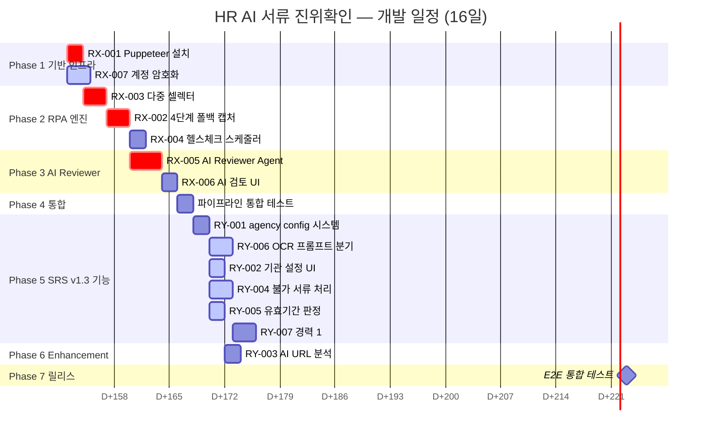

# 🗺️ HR AI 서류 진위확인 — Development Roadmap v1.2

> **GitHub Projects 로드맵 기준** | PRD v1.2 + SRS v1.3  
> **총 14 Task** | **7 Phase** | **예상 기간: 12~16일**

---

## 📌 GitHub Milestone 구성

| Milestone | Phase | 기간 | 핵심 목표 | Task 수 |
|:---:|:---:|:---:|---|:---:|
| **v0.1-infra** | Phase 1 | D+0~2 | Puppeteer 환경 + 보안 기반 | 2 |
| **v0.2-rpa-engine** | Phase 2 | D+2~5 | RPA 캡처 + 셀렉터 + 헬스체크 | 3 |
| **v0.3-ai-reviewer** | Phase 3 | D+5~8 | AI 자동 판정 + 대시보드 UI | 2 |
| **v0.4-pipeline** | Phase 4 | D+8~10 | 전체 파이프라인 통합 | 1 |
| **v0.5-srs-features** | Phase 5 | D+10~14 | 기관 설정 + OCR 스키마 + 불가 서류 | 5 |
| **v0.6-enhancement** | Phase 6 | D+14~15 | AI URL 분석 (Should) | 1 |
| **v1.0-release** | Phase 7 | D+15~16 | E2E 검증 + 릴리스 | — |

---

## 📋 GitHub Issues (Label 체계)

```
Labels:
  priority/critical  🔴    priority/high  🟠    priority/should  🟡
  epic/rpa           🤖    epic/ai        🧠    epic/ui          🎨
  epic/security      🔒    epic/pipeline   ⚙️    epic/ocr         📄
  complexity/H       ⬛    complexity/M    ◾    complexity/L      ▫️
```

| Issue | Title | Labels | Milestone | Assignee |
|:---:|---|---|:---:|:---:|
| #1 | RX-001 Puppeteer + Stealth 로컬 환경 구성 | `critical` `epic/rpa` `L` | v0.1 | — |
| #2 | RX-007 기관 계정 AES-256-GCM 암호화 저장 | `high` `epic/security` `M` | v0.1 | — |
| #3 | RX-003 다중 셀렉터 + AI 자가복구 시스템 | `high` `epic/rpa` `H` | v0.2 | — |
| #4 | RX-002 4단계 폴백 캡처 엔진 | `critical` `epic/rpa` `H` | v0.2 | — |
| #5 | RX-004 사이트 헬스체크 스케줄러 | `high` `epic/rpa` `M` | v0.2 | — |
| #6 | RX-005 AI Reviewer Agent (Gemini Vision) | `critical` `epic/ai` `H` | v0.3 | — |
| #7 | RX-006 대시보드 AI 검토 결과 패널 UI | `high` `epic/ui` `M` | v0.3 | — |
| #8 | RY-001 agency_config.json hot-load 시스템 | `high` `epic/rpa` `M` | v0.5 | — |
| #9 | RY-006 서류 유형별 OCR 프롬프트 분기 | `critical` `epic/ocr` `H` | v0.5 | — |
| #10 | RY-002 기관 설정 PM 셀프서비스 UI | `high` `epic/ui` `M` | v0.5 | — |
| #11 | RY-004 진위확인 불가 서류 대체 처리 | `high` `epic/pipeline` `M` | v0.5 | — |
| #12 | RY-005 유효기간 자동 판정 + 이전 자격증 | `high` `epic/ai` `M` | v0.5 | — |
| #13 | RY-007 경력사항 career_records 1:N 대조 | `high` `epic/pipeline` `H` | v0.5 | — |
| #14 | RY-003 AI 자동 URL 분석 (셀렉터 탐지) | `should` `epic/ai` `H` | v0.6 | — |

---

## 🔀 Task 의존성 DAG (Directed Acyclic Graph)

> 화살표(→)는 "선행 완료 후 시작 가능"을 의미합니다.

```mermaid
graph TD
    subgraph "Phase 1 — 기반 인프라"
        RX001["🟢 RX-001<br/>Puppeteer 설치<br/>L · D+0~1"]
        RX007["🔒 RX-007<br/>계정 암호화<br/>M · D+0~2"]
    end

    subgraph "Phase 2 — RPA 엔진"
        RX003["🤖 RX-003<br/>다중 셀렉터<br/>H · D+2~4"]
        RX002["🤖 RX-002<br/>4단계 폴백 캡처<br/>H · D+3~5"]
        RX004["📡 RX-004<br/>헬스체크<br/>M · D+4~5"]
    end

    subgraph "Phase 3 — AI Reviewer"
        RX005["🧠 RX-005<br/>AI Reviewer Agent<br/>H · D+5~8"]
        RX006["🎨 RX-006<br/>AI 검토 UI<br/>M · D+7~8"]
    end

    subgraph "Phase 5 — SRS v1.3 기능"
        RY001["⚙️ RY-001<br/>agency_config 시스템<br/>M · D+10~11"]
        RY006["📄 RY-006<br/>OCR 프롬프트 분기<br/>H · D+10~12"]
        RY002["🎨 RY-002<br/>기관 설정 UI<br/>M · D+11~12"]
        RY004["📦 RY-004<br/>불가 서류 처리<br/>M · D+11~13"]
        RY005["⏰ RY-005<br/>유효기간 판정<br/>M · D+11~12"]
        RY007["🔍 RY-007<br/>경력 1:N 대조<br/>H · D+12~14"]
        RY003["🧠 RY-003<br/>AI URL 분석<br/>H · D+14~15"]
    end

    %% Phase 1 → Phase 2
    RX001 --> RX003
    RX001 --> RX007
    RX001 --> RX002

    %% Phase 2 내부
    RX003 --> RX002
    RX002 --> RX004
    RX003 --> RX004

    %% Phase 2 → Phase 3
    RX002 --> RX005

    %% Phase 3 내부
    RX005 --> RX006

    %% Phase 2 → Phase 5
    RX002 --> RY001
    RX003 --> RY001
    RY001 --> RY002
    RY001 --> RY004
    RY001 --> RY005
    RY001 --> RY006
    RY006 --> RY007
    RY002 --> RY003
    RX005 --> RY003
end
```

### DAG 핵심 요약

| 구분 | 내용 |
|---|---|
| **크리티컬 패스** | `RX-001 → RX-003 → RX-002 → RX-005 → RX-006` (8일) |
| **병렬 가능 쌍** | `RX-001 ∥ RX-007` · `RX-003 ∥ RX-007` · `RY-004 ∥ RY-005 ∥ RY-006` |
| **독립 실행 가능** | `RX-004` (헬스체크), `RX-006` (UI) — 선행만 충족되면 별도 진행 |
| **최종 합류점** | Phase 7 E2E 테스트 — 모든 Task 완료 후 |

---

## 📊 Gantt 차트 (WBS 형식)

> Mermaid Gantt 다이어그램 — `crit` = 크리티컬 패스, `active` = 병렬 작업 가능



### WBS 요약표

| WBS | Phase | Task | 복잡도 | 기간 | 선행 | 병렬 |
|:---:|:---:|---|:---:|:---:|---|:---:|
| 1.1 | 1 | RX-001 Puppeteer 설치 | L | 2d | — | ∥ 1.2 |
| 1.2 | 1 | RX-007 계정 암호화 | M | 3d | — | ∥ 1.1 |
| 2.1 | 2 | RX-003 다중 셀렉터 | H | 3d | RX-001 | — |
| 2.2 | 2 | RX-002 4단계 폴백 | H | 3d | RX-003 | — |
| 2.3 | 2 | RX-004 헬스체크 | M | 2d | RX-002 | — |
| 3.1 | 3 | RX-005 AI Reviewer | H | 4d | RX-002 | — |
| 3.2 | 3 | RX-006 AI 검토 UI | M | 2d | RX-005 | — |
| 4.1 | 4 | 파이프라인 통합 | M | 2d | RX-006 | — |
| 5.1 | 5 | RY-001 agency_config | M | 2d | P-001 | — |
| 5.2 | 5 | RY-006 OCR 프롬프트 | H | 3d | RY-001 | ∥ 5.3~5.5 |
| 5.3 | 5 | RY-002 기관 설정 UI | M | 2d | RY-001 | ∥ 5.2,5.4,5.5 |
| 5.4 | 5 | RY-004 불가 서류 | M | 3d | RY-001 | ∥ 5.2,5.3,5.5 |
| 5.5 | 5 | RY-005 유효기간 | M | 2d | RY-001 | ∥ 5.2,5.3,5.4 |
| 5.6 | 5 | RY-007 경력 1:N | H | 3d | RY-006 | — |
| 6.1 | 6 | RY-003 AI URL 분석 | H | 2d | RY-002 | — |
| 7.1 | 7 | E2E 통합 테스트 | — | 2d | ALL | — |

---

## 🤖 Strategy 2: 오케스트레이션형 Harness (Hands-Off 극대화)

> **목표:** AI 에이전트가 Phase별로 자율적으로 Task를 실행할 수 있도록, DAG 의존성을 Harness 파일에 인코딩하여 "**다음 Task 자동 판별 + 연속 실행**"을 가능하게 합니다.

### 개념도

```
┌─────────────────────────────────────────────────────────────────┐
│  🎯 오케스트레이터 (Workflow: /execute-next-task)                  │
│                                                                 │
│  1. task-status.json 읽기 (각 Task의 완료 여부)                    │
│  2. DAG 기반으로 "선행 완료 + 미착수" Task 탐색                     │
│  3. 해당 Task의 전용 서브에이전트 호출                              │
│  4. 서브에이전트가 Task 실행 → 테스트 → 커밋                       │
│  5. task-status.json 업데이트                                     │
│  6. 다음 실행 가능 Task 안내 (또는 자동 재귀 호출)                   │
└─────────────────────────────────────────────────────────────────┘
        ↓                    ↓                    ↓
  ┌──────────┐        ┌──────────┐        ┌──────────┐
  │ rpa-engine│        │ocr-ai-   │        │nextjs-   │
  │ agent     │        │pipeline  │        │dashboard │
  │           │        │agent     │        │agent     │
  │ RX-001~004│        │ RX-005   │        │ RX-006   │
  │ RY-001    │        │ RY-003~7 │        │ RY-002   │
  └──────────┘        └──────────┘        └──────────┘
```

### 구현 파일

#### 1) `tasks/task-status.json` — Task 상태 추적

```json
{
  "tasks": {
    "RX-001": { "status": "pending", "agent": "rpa-engine", "phase": 1, "depends_on": [] },
    "RX-007": { "status": "pending", "agent": "rpa-engine", "phase": 1, "depends_on": ["RX-001"] },
    "RX-003": { "status": "pending", "agent": "rpa-engine", "phase": 2, "depends_on": ["RX-001"] },
    "RX-002": { "status": "pending", "agent": "rpa-engine", "phase": 2, "depends_on": ["RX-001", "RX-003"] },
    "RX-004": { "status": "pending", "agent": "rpa-engine", "phase": 2, "depends_on": ["RX-002", "RX-003"] },
    "RX-005": { "status": "pending", "agent": "ocr-ai-pipeline", "phase": 3, "depends_on": ["RX-002"] },
    "RX-006": { "status": "pending", "agent": "nextjs-dashboard", "phase": 3, "depends_on": ["RX-005"] },
    "RY-001": { "status": "pending", "agent": "rpa-engine", "phase": 5, "depends_on": ["RX-002", "RX-003"] },
    "RY-006": { "status": "pending", "agent": "ocr-ai-pipeline", "phase": 5, "depends_on": ["RY-001"] },
    "RY-002": { "status": "pending", "agent": "nextjs-dashboard", "phase": 5, "depends_on": ["RY-001"] },
    "RY-004": { "status": "pending", "agent": "ocr-ai-pipeline", "phase": 5, "depends_on": ["RY-001"] },
    "RY-005": { "status": "pending", "agent": "ocr-ai-pipeline", "phase": 5, "depends_on": ["RY-001"] },
    "RY-007": { "status": "pending", "agent": "ocr-ai-pipeline", "phase": 5, "depends_on": ["RY-006"] },
    "RY-003": { "status": "pending", "agent": "ocr-ai-pipeline", "phase": 6, "depends_on": ["RY-002", "RX-005"] }
  }
}
```

#### 2) `.agents/workflows/execute-next-task.md` — 오케스트레이터 워크플로우

```markdown
---
description: DAG 기반 다음 실행 가능 Task 자동 탐색 및 서브에이전트 위임
---
## Step 1: 상태 읽기
tasks/task-status.json을 읽고 현재 상태를 파악하세요.

## Step 2: 실행 가능 Task 탐색
depends_on의 모든 Task가 "done"인데 본인은 "pending"인 Task를 찾으세요.
여러 개면 phase가 작은 것 우선, 같은 phase면 병렬 실행 가능 목록으로 표시.

## Step 3: Task 실행
해당 Task의 agent 필드에 맞는 서브에이전트를 호출하세요.
Task의 상세 내용은 tasks/TASK-001-HR-AI-Verification-v1_2.md에서 참조.

## Step 4: 완료 처리
// turbo
Task 완료 후 task-status.json의 status를 "done"으로 업데이트.
git commit -m "feat(<scope>): <Task-ID> 구현 완료"

## Step 5: 다음 Task 안내
업데이트된 DAG에서 새로 실행 가능해진 Task 목록을 보고하세요.
```

#### 3) 에이전트 ↔ Task 매핑

| 서브에이전트 | 담당 Task | Epic |
|---|---|---|
| `rpa-engine` | RX-001, RX-002, RX-003, RX-004, RX-007, RY-001 | E-RPA, E-CRED |
| `ocr-ai-pipeline` | RX-005, RY-003, RY-004, RY-005, RY-006, RY-007 | E-AI, E-OCR, E-VERIFY |
| `nextjs-dashboard` | RX-006, RY-002 | E-UI |
| `document-updater` | (Phase 전환 시 문서 동기화) | — |

### Hands-Off 실행 시나리오

```
사용자: /execute-next-task

AI: 📊 현재 상태 분석...
    ✅ 완료: (없음)
    🟢 실행 가능: RX-001 (선행 없음)
    ⏳ 대기: RX-003, RX-007 (RX-001 대기)
    
    → rpa-engine 에이전트에게 RX-001 위임합니다.

[rpa-engine 에이전트 실행 → Puppeteer 설치 + 테스트 + 커밋]

AI: ✅ RX-001 완료! task-status.json 업데이트됨.
    🟢 새로 실행 가능: RX-003, RX-007 (병렬 가능)
    
    다음 실행하시겠습니까? /execute-next-task
```

---

*Roadmap v1.2 | 기반: TASK-001 v1.2 + PRD v1.2 + SRS v1.3 | 생성: 2026-05-13*
